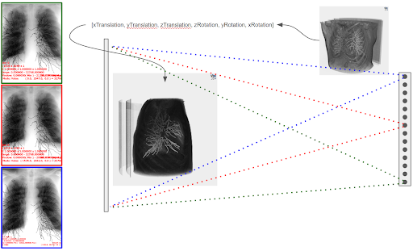
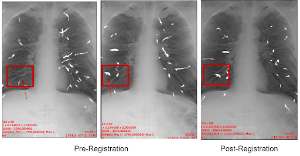

# ITKTubeTK-CTTomosynthesisRegistration

This repository contains modules and notebooks (written in python) to register 3D pulmonary (lung) vascular networks, generated from CT scans, with the corresponding 2D vessels in tomosynthesis projection images, generated using stationary digital chest tomosynthesis (sDCT).\
A registration verification notebook is also included in this repository.  The verification notebook generates a combined image with transformed CT 3D vessels and the 3D tomosynthesis reconstruction volumes so the user can visually assess the success of the registration.\
**Clinical Significance**: registering vessels from a preoperative CT scan with intraoperative Tomosynthesis images will enhance image guided lung biopsies by increasing the practicality of the procedure and reducing the patients' exposure to high CT radiation [^1].

## Registration

**Input**
- *tomoProj_dir*: path to directory of tomosynthesis projection images
- *tomoRecon_dir*: path to directory of tomosynthesis reconstruction images
- *overlay_dir*: path to directory of hand-drawn vessel annotation files
- *emitterGeo_file*: path to file that contains emitter positions
- *vessel_file*: path to .tre file that contains tubes spatial objects of segmented pulmonary vasculature
- *ct_file*: path to CT volume
- *destDir*: path to directory where masked images should be written
- *parentDir*: path to directory where results should be written 
- *solution_output_filename*: string containing .txt name of solution file
- *x_init*: array that contains initial estimated transform to situate vessels prior to registration
- *tomoFileNumber*: number greater than the number of tomosynthesis projections
- *tomoReconFileNumber*: number greater than the number of tomosynthesis reconstruction slices

**Output**:
- *1x6 array*: [xtranslation, ytranslation, ztranslation, zrotation, yrotation, xrotation]

**How To Get .tre Vessel File**
- 	[Kitware Medical: Lung Vessel Segmentation](https://www.example.comhttps://github.com/KitwareMedical/ITKTubeTK-CTLungs) (experiments folder)

**How To Make Annotated Vessel Files**
- [Kitware Medical: ImageViewer](https://github.com/KitwareMedical/ImageViewer) 
- Open image in ImageViewer
- **\\** button until PAINT2D appears in bottom right corner
- **\[** and **\]** buttons to adjust radius size
- Draw over prominant vessels in tomosynthesis reconstruction slices (~8 images)
- **Shift** + **”** buttons to save
- Save file as *“overlayMask_0XX.dcm”* where *XX* is mask number

**View overlay**
- In command window: ```Imageviewer <path-to-image> -j <path-to-overlay>```

___
| |
|:--:| 
| *Registration: Find 3D translation and rotation parameters that align 3D vessel perspective projection with 2D tomosynthesis projection image* |

## Verification

**Input**
- *pipelineDir*: path to directory where results should be written 
- *tube_file*: path to .tre file that contains tubes spatial objects of segmented pulmonary vasculature
- *tube_out_file*: path to directory and file name of the transformed tube file
- *recon_file_3D*: path to 3D tomosynthesis reconstruction
- *ct_file*: path to CT volume
- *solution_output_filename*: string containing file name to registration solution
- *combined_image_filename*: string containing name of combined image file
- *x_init*: array that contains initial estimated transform to situate vessels prior to registration (from registration, except translation in direction may need to be modified and rotation all 0 because re-orientation is not needed)
- *img_3D*: path to tomosynthesis reconstruction with re-adjusted spacing

**Output**
- Combined images
- Compare output of Registration Verification and Untransformed Registration Verification to see if vessel alignment was successful

---
| |
|:--:| 
| *Verification: Compare untransformed, pre-registration CT vessels with transformed, post-registration CT vessels. See how CT vessels align with visable vessels in tomosynthesis reconstruction* |

[^1]: https://www.researchgate.net/publication/269186336_Stationary_chest_tomosynthesis_using_a_carbon_nanotube_x-ray_source_array_A_feasibility_study